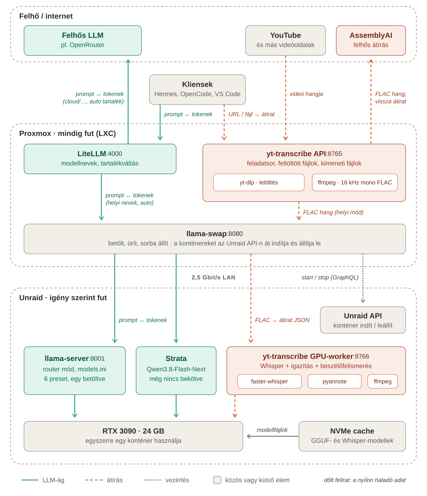

# Helyi AI architektúra

LiteLLM, llama-swap és yt-transcribe a Proxmoxon, GPU-s konténerek az Unraidon. Állapot: 2026. október 9., minden itt leírt elem telepítve és kipróbálva, kivéve ahol a táblázat mást mond.

Kapcsolódó leírások: [telepítés](telepites.md) · [frissítés](frissites.md) · [a yt-transcribe használata](../README.md)

*Zöld folytonos vonal: LLM-ág. Narancs szaggatott: átírás. Szürke pontozott: vezérlés. A dőlt feliratok a nyílon haladó adatot mutatják. Az ábra forrása `architektura.svg`; PNG-ben: `architektura.png`.*

## Cél és kiinduló helyzet

- **Egy GPU van:** az Unraid szerverben lévő RTX 3090 (24 GB). A nagy kontextusú Qwen-modell egyedül kitölti, ezért a beszédmodellek (Whisper, pyannote) csak felváltva férnek hozzá.
- **Az Unraid nem fut mindig,** csak amikor helyi AI-t használsz. A Proxmox szerver mindig fut.
- **Elvárások:**
  - a modellek igény szerint töltődjenek be;
  - átírás közben az LLM-kérések ne hasaljanak el, hanem várjanak;
  - kikapcsolt Unraid mellett is legyen felhős LLM és felhős átírás;
  - felhőbe csak kifejezett választásra menjen adat.

## Komponensek

| Komponens | Hol fut | Port | Feladat | Állapot |
| --- | --- | --- | --- | --- |
| Kliensek | Windows PC | – | Hermes, OpenCode, VS Code. LLM-kérések a LiteLLM-hez, átírás a yt-transcribe API-hoz. | Hermes kész; OpenCode és VS Code még átállítandó |
| LiteLLM | Proxmox, `ai-router` LXC | 4000 | Egyetlen belépési pont az LLM-ekhez: modellnevek, kontextusméretek, tartalékváltás felhőre. | Kész |
| llama-swap | Proxmox, `ai-router` LXC | 8080 | Sorba állítja a kéréseket, és mindig csak egy GPU-s konténert enged futni. A konténereket az Unraid API-n át indítja és állítja le (`unraid-container.sh`). | Kész |
| yt-transcribe API | Proxmox, `ai-router` LXC | 8765 | Letöltés (yt-dlp), átalakítás 16 kHz-es mono FLAC-ká (ffmpeg), feltöltött fájlok, feladatsor, felhős átírás, kimeneti fájlok. | Kész |
| Felhős LLM | OpenRouter | – | `cloud/qwen3.8-flash`, `cloud/mimo-v2.6-flash`, `cloud/gemini-3.8-flash`, és az `auto` meg az `osszefoglalo` tartaléka. | Kész |
| AssemblyAI | Felhő | – | Felhős átírás beszélőfelismeréssel, csak kifejezett kérésre. | Kódban kész |
| YouTube és más oldalak | Internet | – | A videók forrása; a yt-dlp innen tölti le a hangot. | Külső |
| Unraid API | Unraid | 80 (`/graphql`) | Konténerek indítása és leállítása, csak Docker-jogú API-kulccsal. | Kész |
| llama-server | Unraid, `llama.cpp` konténer | 8001 | Hivatalos llama.cpp image router módban. A 6 preset a `models.ini`-ben van, egyszerre egy töltődik be (`--models-max 1`). | Kész |
| yt-transcribe GPU-worker | Unraid, `yt-transcribe-gpu` konténer | 8766 | Átírás (faster-whisper), igazítás (wav2vec2), beszélők (pyannote). Minden feladat külön folyamatban fut, a végén a VRAM felszabadul. | Kész |
| RTX 3090, NVMe | Unraid | – | A GPU-t egyszerre egy konténer használja. A modellfájlok a helyi NVMe-n vannak, nem a hálózaton. | Meglévő |

## Kérésfolyamatok

### LLM-kérés, amikor az Unraid fut

1. A kliens a LiteLLM-nek küldi a kérést a kiválasztott modellnévvel.
2. Helyi név vagy `auto` esetén a LiteLLM továbbadja a llama-swapnak (ugyanabban az LXC-ben).
3. Ha a kért modell konténere nem fut, a llama-swap:
   - megvárja, míg a GPU-t használó konténer befejezi a futó kéréseit;
   - az Unraid API-n át leállítja;
   - elindítja a kért modell konténerét, és megvárja, míg az válaszol.

   A közben érkező kérések sorban várnak.
4. A llama-swap a konténer fix portjára küldi a kérést. A presetek között a llama-server routere vált, a llama-swapban mind a 6 presetnév ugyanannak a konténernek az álneve.
5. A tokenek folyamatosan (streamelve) jönnek vissza ugyanazon az úton.

### LLM-kérés, amikor az Unraid ki van kapcsolva

- **Helyi modellnév:** a llama-swap nem éri el az Unraid API-t, az indítás azonnal hibát ad, és a kérés is hibát ad.
- **Az `auto` név:** a LiteLLM erre a gyors hibára a `cloud/qwen3.8-flash` modellre vált, és 30 másodpercig nem is próbálja a helyit.
- **A `cloud/…` nevek:** a felhő válaszol, az Unraid állapotától függetlenül.

### Átírás helyi módban

1. A Hermes skill a yt-transcribe API-nak küldi a videó URL-jét vagy a feltöltött fájlt, és egyetlen hívásban vár az eredményre (legfeljebb 570 másodpercig, utána a `wait` paranccsal folytatja).
2. Az API a yt-dlp-vel letölti a hangot (vagy a feltöltött fájlt használja), és az ffmpeg-gel 16 kHz-es mono FLAC-ká alakítja.
3. Az API egyetlen HTTP-kérésben elküldi a FLAC-fájlt a llama-swapnak (`/upstream/yt-transcribe-gpu/transcribe`). A llama-swap ilyenkor:
   - megvárja, míg a Qwen befejezi a futó kéréseit;
   - leállítja a llama.cpp konténert;
   - elindítja a GPU-workert.
4. A worker elkészíti az átiratot (Whisper, igazítás, beszélők), és közben 10 másodpercenként jelzi, hol tart. A végén JSON-ban visszaküldi az eredményt; a VRAM a feladat végén felszabadul.
5. Amíg ez a kérés nyitva van, az LLM-kérések sorban várnak. A következő LLM-kérésre a llama-swap leállítja a workert, és visszaindítja a llama.cpp konténert.
6. Az API elkészíti a TXT-, SRT- és JSON-fájlokat. A skill beolvassa az átiratot, és a Qwen megírja az összefoglalót.

### Átírás felirat módban (YouTube-felirat)

1. A skill vagy a webes felület `captions` móddal küldi a kérést.
2. Az API a yt-dlp-vel egyetlen feliratsávot tölt le: a videó nyelvén a feltöltő saját feliratát, ha nincs, a YouTube automatikus feliratát (`json3` formátumban).
3. A szavakból vagy sorokból ugyanolyan szegmensek készülnek, mint a többi módban, beszélők nélkül. GPU, Unraid és költség nem kell hozzá. Ha a felirat nem elég jó, ugyanaz a videó helyi vagy felhős módban is kérhető.

### Átírás felhős módban

1. A skill `--mode cloud` kapcsolóval küldi a kérést, csak ha ezt kifejezetten kéred.
2. Az API letölti a hangot, FLAC-ká alakítja, feltölti az AssemblyAI-hoz, és megvárja az eredményt.
3. A GPU-hoz és az Unraidhoz nem nyúl, ezért kikapcsolt Unraid mellett is működik. A szolgáltatónál az átirat és a hang a letöltés után törlődik.

## Modellnevek a LiteLLM-ben

A LiteLLM a modellválasztóban a konfigurációjában felsorolt összes nevet mutatja, attól függetlenül, hogy az Unraid fut-e. A nevek kiosztása dönti el, mikor mehet adat a felhőbe.

| Név | Hova megy | Ha az Unraid ki van kapcsolva |
| --- | --- | --- |
| A 6 preset neve, pl. `Qwen3.8-27B-UD-Q4_K_XL-Code` | llama-swap → llama.cpp konténer | Hibát ad |
| `cloud/qwen3.8-flash`, `cloud/mimo-v2.6-flash`, `cloud/gemini-3.8-flash` | Csak az OpenRouter | Működik |
| `auto` | Először a helyi Qwen3.8-27B Code preset, hiba esetén `cloud/qwen3.8-flash` | Átvált a felhőre |
| `osszefoglalo` | A webes felület összefoglalói és fordításai nyilvános forrásnál (YouTube, URL): helyi Qwen3.8-27B Gnrl preset, hiba esetén `cloud/qwen3.8-flash` | Átvált a felhőre |
| `osszefoglalo-helyi` | Ugyanez saját felvételnél (feltöltés, Samba): csak a helyi Gnrl preset | Hibát ad; a webes felület vár, amíg az Unraid be nem kapcsol |

## Miért kell a LiteLLM is, ha van llama-swap?

Ez jogos kérdés, a két program sok mindenben átfed. A llama-swap is tud:
- felhős szolgáltatót elérni (`peers`, például OpenRouter, saját API-kulccsal);
- API-kulcsot kérni a kliensektől (`apiKeys`);
- modellenként adatokat mutatni a `/v1/models` válaszában (`metadata`).

**Amit nem tud, az a hiba esetén történő átváltás.** A llama-swap a cél kiválasztásáról a kérés elküldése előtt dönt, és ha a választott cél hibát ad, nem próbálja a következőt. A forráskódban ellenőriztük (v262, `strategySpillover`): a `spillover` választó a terhelés szerint lép tovább, vagyis ha a helyi modellnek már sok futó kérése van. Ha az Unraid ki van kapcsolva, a helyi cél „hideg”, a llama-swap mégis azt választja, és a kérés hibát ad.

Az `auto` név pontosan ezt az esetet fedi le: kikapcsolt Unraid mellett is válaszol, a felhőből. Ezt a LiteLLM végzi (`fallbacks` és 30 másodperces `cooldown_time`). Emellett a LiteLLM:
- egy helyen tartja a helyi és a felhős modellneveket, a kontextusméretekkel együtt;
- elválasztja a „mit kér a kliens” és a „hol fut a modell” kérdést. A llama-swap csak a GPU-t kezeli, a LiteLLM csak a neveket és a tartalékot.

**Ha nincs szükséged az `auto` névre,** a LiteLLM elhagyható. Ekkor:
- a kliensek közvetlenül a llama-swapot hívják (`:8080`);
- a felhős modellek a llama-swap `peers` részébe kerülnek;
- a kontextusméretek a modellek `metadata` mezőjébe.

Ára: kikapcsolt Unraid mellett csak a kifejezetten felhős nevek működnek. Átváltásra a kliensben kell modellt váltani.

## Hálózati forgalom

A Proxmox és az Unraid 2,5 Gbit/s-os LAN-on beszél egymással. A forgalom kicsi, a hálózat nem szűk keresztmetszet (becslések):

| Útvonal | Adat | Nagyságrend |
| --- | --- | --- |
| Kliens → LiteLLM → llama-swap → konténer | Prompt JSON-ban; vissza tokenek folyamatosan (SSE) | Kérésenként legfeljebb kb. 0,5 MB; válasz kb. 30 KB/s |
| llama-swap → Unraid API | GraphQL: indítás, leállítás, állapot | Néhány KB |
| YouTube → yt-transcribe API | A videó hangja | 14 perc kb. 10–15 MB |
| yt-transcribe API → GPU-worker | FLAC hang; vissza átirat JSON-ban | 1 óra hang kb. 60–100 MB; vissza néhány száz KB |
| yt-transcribe API → AssemblyAI | FLAC hang; vissza átirat | Ugyanannyi, interneten |
| NVMe → GPU (Unraidon belül) | Modellfájlok betöltése | 27B Q4 kb. 17 GB; nem megy át a hálózaton |

A válaszidőt a modellváltás határozza meg (konténerindítás és betöltés az NVMe-ről a VRAM-ba, kb. 5–20 s), nem a hálózat.

## Alapelvek

- **Nincs csendes átváltás a felhőbe.** Felhőbe csak a `cloud/…` nevek, az `auto` és az `osszefoglalo` tartaléka és a kifejezetten kért felhős átírás visz adatot. A helyi átírás akkor sem megy a felhőbe, ha az Unraid ki van kapcsolva.
- **Az átírás alapból helyi.** A felhős átírást havi órakeret korlátozza; túllépésnél a munka el sem indul.
- **A modellek az Unraidon maradnak,** a GPU mellett, a helyi NVMe-n. A Proxmox csak irányít, modellt nem futtat.
- **A GPU-t csak a llama-swap osztja ki.** GPU-s konténert nem indítunk kézzel az Unraid felületén, és a kliensek nem érik el közvetlenül a konténerek portjait.
- **Egy belépési pont az LLM-ekhez:** a kliensek csak a LiteLLM címét ismerik, a szerverek mögötte cserélhetők.
- **Nincs Docker-socket a hálózaton:** a llama-swap csak egy szűk jogú Unraid API-kulccsal vezérli a konténereket.

## Korlátok

- **Helyi átírás csak futó Unraiddal.** Kikapcsolt Unraid mellett a felhős átírás elérhető, a helyi hibát ad.
- **Indítóscript.** A llama-swap `cmd`-je egy rövid script, amely az Unraid API-n elindítja a konténert, és addig fut, amíg a konténer fut; a `cmdStop` leállítja. Ugyanezt a mintát követi a llama-swap saját kubeswap példája is.
- **Presetváltás a routeren belül.** Code és Gnrl között váltva is újratöltődik a modell, mert a router minden presetet külön folyamatként indít. Később optimalizálható: modellfájlonként egy preset, a mintavételi beállításokat a llama-swap kérésenként adja hozzá (`setParamsByID`).
- **Kézi indítás veszélye.** Ha valaki az Unraid felületén indít el egy GPU-s konténert, arról a llama-swap csak a következő indításkor tud. Az indítóscript ilyenkor leállítja a többi GPU-s konténert, de addig két folyamat foglalhatja a VRAM-ot.
- **A KV cache elvész cserénél.** Ha a llama-swap leállítja a Qwent, a prompt cache is elvész, és a beszélgetést újra fel kell dolgoznia.
- **Időkorlátok.**
  - Egy helyi átírás legfeljebb 30 percig fut, hosszú hangnál a hang hosszának négyszereséig (`WORKER_TIMEOUT_MIN`). Ha lejár, a munka leáll, és a worker elengedi a GPU-t.
  - A Hermes egy terminálhívása legfeljebb 600 másodpercet várhat.
- **Tartalékváltás ára.** Az `auto` átváltáskor a teljes beszélgetést a felhőbe küldi: ez pénzbe kerül, és az adat kikerül a hálózatból.

## Kipróbált, de kimaradt: Strata

A Strata (Qwen3.8-Flash-Next) telepítve volt az Unraidon, de nem került a llama-swap alá:
- **Lassú indulás.** Indításkor kb. 3,5–4 percig tölt. A llama-swap minden modellváltáskor újraindítja a konténereket, így minden váltás ennyi várakozást jelentene, az átírás utáni visszaváltás is.
- **Nem jobb a meglévőknél.** A saját méréseink szerint (tool-eval-bench):

  | Modell | Eredmény | Futási idő |
  | --- | --- | --- |
  | Qwen3.8-27B | 96,1% | 16 perc |
  | Strata | 90,6% | 12 perc |
  | Qwen3.6-35B-A3B gondolkodás nélkül | 89,8% | 2,4 perc |

  A Qwen3.6-35B-A3B tehát ugyanazt az eredményt adja, és néhány másodperc alatt betölt. Sok rövid kérésnél a Strata lassabb is volt, mint a llama.cpp.

Ha később mégis kellene, ugyanúgy köthető be, mint bármely más GPU-s konténer; a lassú indulás beállításai a [frissítési leírásban](frissites.md#új-gpu-s-konténer-bekötése) vannak.

## Ami még hátravan

- Az OpenCode és a VS Code átállítása a LiteLLM-re. Az OpenCode beállítófájlja kész: `deploy/clients/opencode.json`.
- A felhős átírás éles próbája AssemblyAI-kulccsal, magyar és angol videóval.
